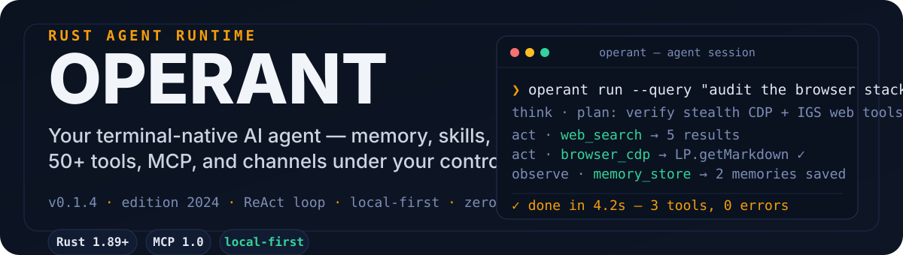

# Operant


[](https://github.com/ishan-parihar/operant/actions/workflows/ci.yml)


**Your terminal-native AI agent.** Persistent memory, 60+ JSON-schema tools, skills, MCP, and messaging channels — built in Rust, run from your shell, and fully under your control.



---

## Quick start

```bash
git clone https://github.com/ishan-parihar/operant.git && cd operant

./scripts/install.sh          # release build → /usr/local/bin/operant
# or: cargo build --release -p operant-cli

operant setup                 # interactive wizard: provider, memory, TTS, gateway
operant chat                  # start chatting (TUI)
```

One-shot runs need no TUI at all:

```bash
operant run --query "Audit the browser stack: check IGS web tools and the CDP browser"
```

---

## What it is

Operant is a production-grade **ReAct agent runtime** written in Rust. It replaces the "script per task" pattern with one agent that can **think, use tools, and remember** — over a long-lived terminal session or in scriptable one-shot runs.

Why it is different:

- **A real agentic loop, not a chat wrapper** — think → act → observe with a JSON-schema tool registry, automatic memory-context injection, provider fallbacks, and self-healing retries.
- **Memory that behaves like a plugin** — the default `agentmemory` provider (BM25 + vector + graph, hybrid search) auto-spawns on first use and mirrors the hermes-agent memory-plugin lifecycle: `session/start` on init, `observe` after every turn, context recall before each turn, session/end on exit.
- **Skills you can point at a directory** — import an entire skill tree (with recursive security scan), bundle multiple skills, autoload at boot, and let the agent curate new ones.
- **Only enabled, functional tools reach the model** — the registry serves the intersection of *registered ∩ available ∩ not-disabled*, so the agent never sees tools that can't run.
- **One stealth browser for everything** — the `obscura` CDP browser and the IGS web tools (search / scrape / extract) share the same Obscura binary, auto-provisioned on first use.
- **Local-first** — no telemetry, no account required; bring any OpenAI-compatible endpoint or a local model.

---

## How it works

The agent loop is a classic ReAct cycle, executed with bounded iterations and tool timeouts:

```
 user ──▶ model ──▶ act (tool registry) ──▶ observe ──▶ next step
              ▲                                │
              └──────── memory context ◀───────┘
```

- **Registry** — every tool exposes a runtime JSON schema; `get_schemas()` feeds exactly what is enabled.
- **Memory** — pre-turn `prefetch()` injects `<memory_context>`; post-turn `queue_prefetch()` warms the provider; compression hooks fire on long sessions.
- **Resilience** — fallback model chains, rate-limit buckets with exponential backoff, and tool call healing (`max_healing_attempts`).

### Crate map

```
operant
├── crates/
│   ├── operant-core         agent loop · tool registry · memory provider · config
│   ├── operant-cli          TUI (ratatui) · commands · app adapter
│   ├── operant-tools        built-in tool implementations
│   ├── operant-providers    LLM provider adapters
│   ├── operant-memory       memory backends (agentmemory / builtin / …)
│   ├── operant-plugins      WASM plugin bridge
│   ├── operant-gateway      messaging gateway (telegram, discord, …)
│   ├── operant-channels     channel orchestrator
│   ├── operant-runtime      autonomous runtime agent
│   ├── operant-config       config schema · validation · defaults
│   └── …                    api · infra · macros · eval · hardware · robot-kit
```

---

## Features

| Capability | Implementation |
|---|---|
| **Memory** | `agentmemory` hybrid semantic memory (BM25 + vector + graph), auto-spawned; or `builtin` file memory (`MEMORY.md` / `USER.md`) |
| **Tools** | 60+ JSON-schema tools: fs, git, web (IGS search/scrape/extract), browser (CDP), shell, code, http, memory, skills, cron, kanban, process, notes, checkpoints |
| **Browser** | Stealth **Obscura** CDP — persistent socket, page sessions, shared binary with IGS web tools |
| **Skills** | Directory import with recursive security scan · bundles · autoload · curator |
| **Models** | Any OpenAI-compatible endpoint (`base_url`), local llama.cpp, Ollama; fallback chains + token-bucket rate limiting |
| **MCP** | Native client (stdio + HTTP, deferred loading) **and** server; reconnect materializes tools mid-session |
| **Channels** | Telegram · Discord · Slack · WhatsApp · email · webhooks via the gateway |
| **Autonomy** | `operant autonomous` — a self-directed dev loop over `TODO.md` with test-command guardrails |
| **Plugins** | WASM plugin tools + hermes-agent hook parity (before/after tool, turn, memory hooks) |
| **Interface** | ratatui TUI · interactive chat · scriptable `run` · one-shot `test` |

---

## Skills

Skills are **markdown instruction packs** — the same mechanism hermes-agent uses — that the agent loads and injects into its context on demand. They teach operant *how to do* things (debugging protocols, git workflows, security methodology) so it behaves like an experienced operator rather than a generic model. Invoke one in the TUI with `/skill <name>`; the agent can also call the `skill` tool itself mid-loop.

### Directory layoutOperant ships a **categorized** pool in the repo, and installs it **flat** into the user skills directory (matching `operant skills seed`):

```
repo:                                   installed (user):
skills/                                 ~/.operant/skills/
├── devops/                             ├── cli/                 # skills are
│   ├── cli/SKILL.md                     │   ├── docker-management/  # FLAT — each
│   └── docker-management/SKILL.md      │   ├── …                  # leaf skill is
├── github/                             ├── systematic-debugging/  # a direct
├── mcp/                                ├── test-driven-development/ # subdir
├── productivity/                       ├── …
├── research/                           └── <105 skills total>
├── security/
├── software-development/
├── workspace-lint/
├── autonomous-ai-agents/               (hermes-core parity — apple, creative,
├── apple/                               email, media, mlops, note-taking,
├── creative/                            smart-home, social-media + operant
├── email/                               self-skill)
├── media/
├── mlops/
├── note-taking/
├── smart-home/
└── social-media/
```

Each skill is a directory containing a `SKILL.md` (required) plus any reference files, scripts, and templates:

```
~/.operant/skills/systematic-debugging/
├── SKILL.md          # frontmatter + instructions (injected verbatim)
└── …                 # optional references/ scripts/ examples/
```

### SKILL.md frontmatter

```yaml
---
name: systematic-debugging        # slug used by /skill <name> and the skill tool
description: "4-phase root cause debugging."  # one-line summary for the model
author: Operant                  # provenance
license: MIT
platforms: [linux, macos, windows]
version: 1.1.0
metadata:
  operant:
    tags: [debugging, root-cause]       # used by the curator & search
    related_skills: [plan, tdd]         # auto-suggested companions
---
```

### Seeding (fresh installs are agent-ready from scratch)

| Path | What it does |
|---|---|
| `./scripts/install.sh` | Builds the binary **and** seeds `~/.operant/skills` from the repo pool (offline, idempotent) |
| First run | If the skills dir is empty, the binary auto-seeds from the bundled pool (`OPERANT_BUNDLED_SKILLS_DIR` override, then `<repo>/skills`, then `<exe>/../skills`) |
| `operant skills seed [--source DIR] [--force]` | Manual re-seed; `--force` overwrites local edits |

Location overrides (the binary honors these too):

```bash
export HERMES_HOME=~/.operant          # home root (skills default under it)
export HERMES_SKILLS_DIR=/custom/skills # exact skills dir (config [skills] root_dir)
export OPERANT_BUNDLED_SKILLS_DIR=/path/to/pool  # where seeding reads from
```

### Managing skills

```bash
operant skills list          # installed skills (+ /name for the TUI)
operant skills install ./foo # import a skill dir or URL (recursive security scan)
operant skills bundle        # combine skills into one
operant skills audit         # scan for unsafe patterns (skills_guard)
operant curator              # agent-curated skill lifecycle (archive/backup/restore)
```

---

## Configuration

Config lives at `~/.operant/operant.toml` (secrets in `~/.operant/.env`). Start from the annotated reference:

```bash
cp operant.example.toml ~/.operant/operant.toml
operant doctor        # validate config + dependencies
operant status        # system overview
```

Highlights:

```toml
[client]              # any OpenAI-compatible endpoint
base_url = "https://api.openai.com/v1"

[agent]
model = "gpt-4"
fallbacks = [ { model = "gpt-4o-mini" } ]
max_iterations = 20

[memory]
provider = "agentmemory"      # or "builtin"

[tools]
igs_enabled = true            # IGS web tools + browser
# obscura_stealth = true

[skills]
autoload = true
```

See [`operant.example.toml`](operant.example.toml) for the full reference — every section is annotated.

---

## CLI reference

| Command | What it does |
|---|---|
| `operant` / `operant chat` | Interactive chat (TUI) |
| `operant run --query "…"` | One-shot run (scriptable, `--record-trajectory` for replay) |
| `operant autonomous` | Self-directed development loop |
| `operant setup` | Interactive setup wizard |
| `operant tools list` | Inspect the enabled tool registry |
| `operant skills list / install / audit` | Skill management (install a directory or URL) |
| `operant mcp list / connect` | MCP servers; `/mcp r` in the TUI reconnects deferred servers |
| `operant memory query / export` | Search / export memory |
| `operant sessions list` | Session history |
| `operant model get / set` | Active model configuration |
| `operant cron` / `operant kanban` | Scheduled jobs / task boards |
| `operant gateway start` | Messaging gateway (telegram, discord, slack, whatsapp) |
| `operant plugins list` | WASM plugins |
| `operant doctor` / `operant status` | Health checks and system overview |

`operant --help` lists the full set (sessions, checkpoints, profiles, auth, completion, backups, SOPs, hardware, and more).

---

## Requirements

- **Rust 1.89+** (edition 2024)
- 4 GB RAM (8 GB recommended)
- A model: any OpenAI-compatible endpoint, or a local llama.cpp / Ollama server
- Optional: [igs](https://github.com/ishan-parihar/igs-rust) binary for IGS web tools and the shared Obscura browser

---

## Development

```bash
cargo fmt --all
cargo clippy --workspace --all-targets --all-features -- -D warnings
cargo test --workspace
./scripts/self-test.sh       # full pre-PR validation
```

Architecture, porting notes, and parity decisions live in [`AGENTS.md`](AGENTS.md) and [`docs/`](docs/) (audits, BUGS, CHANGELOG, TODO).

---

## License

MIT **or** Apache-2.0 — see [LICENSE-MIT](LICENSE-MIT) or [LICENSE-APACHE](LICENSE-APACHE).

---

## ☕ Support & Sponsorship

If you find this project useful, consider supporting ongoing development:

[](https://github.com/sponsors/ishan-parihar)
[](https://rzp.io/rzp/ishan-parihar)

Your support funds new features, releases, and infrastructure for the whole ecosystem.