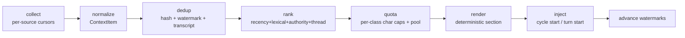

# DM/feed context injection — architecture (2026-10-08)

Status: DESIGN (outline + architectural plan; no code yet, per owner order).
This is gap 5's design doc from
`plan-2026-10-08-remaining-implementation-gaps.md`, upgraded with the owner's
2026-10-08 rulings: per-aspect character quotas (like the MEMORY.md budget)
and re-ranking across the four aspect classes.

## §0 Rulings recorded (2026-10-08, owner)

1. **Unattended posture (BUGS.md D-2) — DECIDED**: the unattended
   dangerous-tool posture is a property of the **governance configuration
   that already manages tool permissions** — the seat's policy row
   (`seat_policies`) with a global fallback (`[genome]`), not a separate
   seam or a hardcoded behavior:
   - Per-seat: the existing mode ladder expresses it — `yolo` seats stay
     yolo even unattended (standing owner directive); `lockdown` fails
     closed; `scoped` allows only scoped tools; `standard` fails closed on
     dangerous tools when no human can answer.
   - Global: `[genome].unattended_posture` supplies the default for seats
     with no policy row (default: `yolo`, preserving today's behavior).
   - That config, and only that config, manages the unattended posture.
   Implementation is a consult at the existing guard
   (`stream.rs:811` keys `seat_id().or_else(session_id())` — seat binding
   already landed iter-672) reading the policy row / global default.
2. **Context injection quotas**: per-aspect character caps (four aspect
   classes below), configurable globally with per-seat overrides,
   mirroring the `seat_budgets` pattern.
3. **Re-ranking**: relevance-ranked selection within each class, with a
   cross-class roll-over pool — recency, lexical affinity, author
   authority, and thread participation compose the score.

## §1 Problem

Seats run blind. Gateway platform adapters are outbound-only; inbound
exists solely as turn triggers. A seat's cycle prompt contains only its
charter + seat memory — it cannot see what happened since its last cycle:
what the org broadcast, what its department produced, what it itself
previously published, or what was DM'd to it. The owner wants platform
DMs/feeds injected as runtime context, **always nonredundant and
relevant**, under explicit character budgets.

## §2 Source taxonomy — four aspect classes (owner's list)

| Class | Content | Phase-1 source (already stored today) | Phase-2 source |
|---|---|---|---|
| **M — DMs** | Messages addressed to the seat | gateway DM transcripts (session store), `org dm` threads | platform inboxes (Telegram getUpdates/getChat, Discord history, Slack conversations.history) |
| **G — global feeds** | Org-wide broadcasts | premiere/chief-of-staff worklog outputs, governance digests | notice board (slices 4/5, once landed) |
| **D — department feeds** | Department-scoped items | worklog rows filtered by department membership | department channels/notice boards |
| **S — self feeds** | The seat's own previous outputs | its own worklog rows + its own prior cron outputs | — (already complete in phase 1) |

Phase 1 uses only data we already persist — zero external API risk, and
the seats' inter-visibility goes live immediately. Phase 2 adds platform
read adapters that write into the same normalized store; the pipeline is
untouched. The notice-board source joins phase 1's store the moment the
peer's `cmd_org.rs` work lands (wave C of the gaps plan).

## §3 Pipeline — seven stages, one seam



### 3.1 Collect
Per-seat, per-class monotonic read cursors
(`context_watermarks(seat_id, class, cursor)`) — the redundancy backbone.
Phase-1 collectors are SQL queries over existing tables (worklog,
sessions, org dm) filtered by the cursor.

### 3.2 Normalize
One row shape, one table:
`context_items(id PK, class, author_seat, ts, content_hash, text, thread_ref, seat_hint)`.
Every collector writes here; the pipeline reads only this table. Stable
`id`s make re-renders idempotent.

### 3.3 Dedup (the "always nonredundant" guarantee)
Three layers, cheapest first:
1. **Watermark** — items at/below the cursor are never collected again.
2. **Content hash** — `content_hash` over normalized text; an item
   arriving in two classes (a premiere notice relayed as a DM) renders
   once, as the DM form (addressing context preserved).
3. **Transcript check** — live gateway sessions skip items whose hash
   already appears in the recent conversation turns; cron cycles are
   fresh, so the watermark is their only guard.

### 3.4 Rank (the "relevant" guarantee)
`score = w_rec·recency + w_lex·lexical + w_auth·authority + w_thr·thread`

- **recency** — exponential decay; feeds half-life 24h, DMs 168h (a
  direct message stays relevant longer than a broadcast).
- **lexical** — token overlap between the item and the seat's charter +
  job description + MEMORY.md headings (all already in the registry);
  dependency-free, deterministic.
- **authority** — author rank: premiere > chief-of-staff > department
  heads > crew > dp-the-program (owner outranks everything).
- **thread** — +participation boost when the seat authored or replied in
  the item's thread.

Weights live in config; defaults boring and pinned by tests. No embeddings,
no model calls, no new dependencies — same in-process philosophy as
memory-wire's recall scoring.

### 3.5 Quota (the per-aspect character budget)
- Global defaults + per-seat overrides
  (`seat_context_quotas(seat_id PK, dm, global, dept, self)` mirroring
  `seat_budgets`).
- Each class fills greedily by rank until its char cap.
- **Roll-over pool**: unused class budget merges into a shared pool,
  filled by global rank across all remaining items — a quiet day for DMs
  lets the global feed breathe, without letting any class monopolize.
- Directives from the owner/premiere carry a reserved slice: they may
  exceed their class cap up to a hard total cap; nothing else can.
- A total cap bounds the whole section (sum of classes, checked last).

### 3.6 Render
Deterministic markdown, one composed section, self-describing like seat
memory's header:

```markdown
## Injected context (since 2026-10-08T09:00Z — DMs, feeds)
### DMs addressed to you (3 items, 640 chars)
...
### Global feed (2 items, 480 chars)
...
```

Position: volatile suffix (with seat memory, after the frozen prefix) —
prompt-cache stability preserved per the context_management split.

### 3.7 Inject + advance
- **Cron cycles**: compose in `run_agent_job` where seat memory already
  layers in (`scheduler.rs`); injection failure or empty result degrades
  to the prompt **byte-identical** (the iter-666 contract).
- **Gateway turns**: at turn start alongside the budget consult
  (`gateway_runner.rs:1040-1160` area); the session's own inbound message
  is never re-injected to it (transcript check).
- Watermarks advance **only after successful injection** — a failed cycle
  re-collects next run (at-least-once; content-hash + stable ids make the
  re-render idempotent, never duplicated).

## §4 Configuration surface (operant.example.toml in the same change)

```toml
[context_injection]
enabled = true
total_char_cap = 2000            # hard ceiling for the whole section

[context_injection.classes]      # per-aspect char quotas
dm = 800
global_feed = 500
department_feed = 400
self_feed = 300

[context_injection.ranking]
recency_halflife_hours_feed = 24
recency_halflife_hours_dm = 168
weights_recency = 1.0
weights_lexical = 1.0
weights_authority = 0.5
weights_thread = 0.3

[genome]
unattended_posture = "yolo"      # D-2 ruling: governance-managed default
```

Per-seat overrides live in the org DB (`seat_context_quotas`), mirroring
`seat_budgets(employee_id PK, ...)`; CLI provisioning folds into
`operant budget`/`org budget` surfaces (wave C).

## §5 Storage schema (org db, mirroring cron_runs' append-only discipline)

```sql
context_items(id INTEGER PRIMARY KEY AUTOINCREMENT,
  class TEXT NOT NULL,          -- dm|global|dept|self
  author_seat TEXT, ts INTEGER NOT NULL,
  content_hash TEXT NOT NULL,    -- dedup key
  text TEXT NOT NULL, thread_ref TEXT,
  seat_hint TEXT);              -- addressed seat, when known
CREATE INDEX idx_context_items_class_ts ON context_items(class, ts);
CREATE INDEX idx_context_items_hash ON context_items(content_hash);

context_watermarks(seat_id TEXT, class TEXT, cursor INTEGER,
  PRIMARY KEY(seat_id, class));

seat_context_quotas(seat_id TEXT PRIMARY KEY,
  dm INTEGER, global INTEGER, dept INTEGER, self INTEGER);
```

Append-only items; watermarks are the only mutable rows; no FKs to jobs
(history outlives deletion — cron_runs precedent).

## §6 Governance interplay

- Injection cost is governed by **character quotas** (this doc), not the
  $-envelope (that's gap 1, the budget envelope for model spend — a
  separate meter). A row recording injected chars goes to the worklog for
  observability.
- Scoped seats receive only items their scopes permit (a scoped seat does
  not see department feeds outside its scope) — the scope check reuses
  the seat's policy row; **the same governance config manages both tool
  permissions and the unattended posture** (§0.1), so injection filters
  read one source of truth.
- DMs addressed to a seat are never shown to another seat (per-seat
  watermark + `seat_hint` filter).

## §7 Phasing

| Phase | Scope | Effort | Blockers |
|---|---|---|---|
| **0** | This doc + plan update | done here | — |
| **1** | Org-internal sources: `context_items` + collectors (worklog→self/dept/global, DM transcripts), pipeline (dedup/rank/quota/render), cron injection seam, gateway turn-start seam, config + CLI | M | none — fully unblocked today |
| **2** | Platform read adapters (Telegram/Discord/Slack) writing `context_items` via the same collectors | L per-platform | phase-1 store merged |
| **3** | Socialization sessions (gap 6) ride the same injected context + `org dm` substrate | M | its own design doc, references this one |

Phase 1 does not wait on the peer's `cmd_org.rs`: worklog + DM transcripts
cover S/D/G/M for internal traffic; the notice board joins as a collector
when wave C lands.

## §8 Tests (pinned contracts, boring and deterministic)

1. Watermark monotonicity: an injected item never re-injects; a failed
   cycle re-collects; re-render is idempotent (stable ids).
2. Content-hash dedup across classes: one render, DM form wins.
3. Quota enforcement: class caps honored; roll-over pool fills from
   leftovers; total cap clamps the directive-reserved slice.
4. Ranking determinism: recency/lexical/authority/thread boosts pinned on
   fixed fixtures.
5. Degradation: no sources / pipeline error → prompt byte-identical
   (iter-666 contract extended).
6. Scope filter: a scoped seat's injection excludes out-of-scope classes.

## §9 Acceptance

- A cron seat's cycle prompt contains a bounded, deduplicated, ranked
  context section (DMs + global + department + self), under configured
  char quotas, advancing watermarks per successful cycle.
- A gateway turn sees cross-session feeds/DMs it has not already consumed,
  never its own inbound message duplicated back.
- Re-running a cycle (retry-armed or manual) never duplicates context.
- Empty-context runs are byte-identical to today's behavior.
- `operant.example.toml` documents every knob; the two-tier memory doc's
  pattern (absent = byte-identical) holds for every source.

## §10 Open questions — resolved by default (no further round-trip needed)

1. Cycle-pull vs event-push for phase-2 platform reads → **cycle-pull**
   (boring; the tick loop stays serial and never blocked; push adds an
   event surface for no owner-visible gain yet).
2. Do DMs count against the $-budget envelope? → No; chars are the meter
   here, $ envelope is model spend (gap 1). Revisit only if quotas prove
   insufficient as a cost control.
3. Ranking service vs in-process scorer → in-process scorer (no new deps,
   matches memory-wire philosophy).
