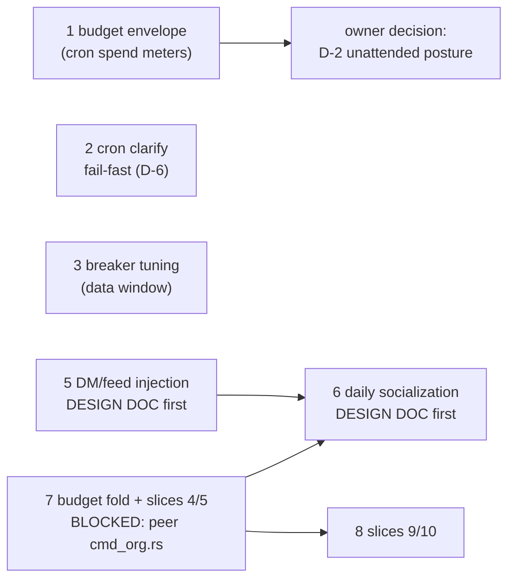

# Remaining implementation gaps — outline plan (2026-10-08)

Status: OUTLINE. The execution stretch iters 661–673 closed every gap in the
2026-10-07 flaw audit; this is what remains after them, ordered by dependency
wave. Scope guard: the peer's `plan-2026-10-07-agentic-core-verified-remaining-work.md`
owns the ENGINE programme (guardrail ladder, steering, context ceilings,
dead-code); this plan owns the ORG/ORGANISM + governance programme. §6 of
their doc scopes the org layer to here explicitly. Zero overlap by design.

Provenance anchors (all verified at tip `5740997d`): budget envelope
construction `gateway_runner.rs:1040-1160`, turn-usage drain
`gateway_runner.rs:1157-1181` keyed `(platform, channel_id, thread_id)`,
wave-4 usage trap `gateway_runner.rs:3935`, seat seam
`scheduler.rs` `resolve_seat_id`/`run_agent_job`, BUGS.md D-2/D-6.

## Wave A — unblocked, substrate live

### 1. Cron-path budget envelope (recorded follow-up of iter-672) — DONE iter-678 `25ec77ce`
- **Problem**: seat budget provisioning (670/671) and policy binding (672)
  are live, but cron-run SPEND doesn't meter — a capped seat's cron jobs
  spend unmetered. Cron Usage events flow to the gateway receiver (shared
  `event_tx`) and drain under gateway DM keys `(platform, channel_id,
  thread_id)` (`gateway_runner.rs:1157-1181`) — cron-emitted events lack
  those, so `employee_window_usage` stays blind for cron. The wave-4 trap
  (`gateway_runner.rs:3935`: "before the wire, usage returned 0 forever")
  is the cautionary precedent.
- **Approach**:
  1. Instrument ONE live cron run — capture a Usage event, record the exact
     key fields cron events carry. No static reading substitutes for this.
  2. Scheduler-side drain: after `agent.run`, drain the run's usage into
     `employee_window_usage` under the resolved seat (`resolve_seat_id`,
     the one-resolution helper).
  3. Turn-start consult mirroring `gateway_runner.rs:1040-1160`:
     `resolve_budget` → `window_start` → `employee_window_usage` →
     hard-refuse or `SEAT_BUDGET_ENVELOPE.scope(...)`.
  4. Refusals recorded in `cron_runs` with an explicit origin
     (`budget_block`, alongside `scheduled`/`retry-armed`/`gate_block`).
- **Acceptance**: with a cap set, an over-cap cron run is refused with an
  auditable `cron_runs` row; cron spend visible in the budget surfaces.
- **Effort**: M. **Blockers**: none.

### 2. Cron `clarify` fail-fast (BUGS.md D-6 tail) — DONE iter-677 `adbf45cb`
- **Problem**: `USER_QUESTION_TX` (`user_question.rs:39`) is process-global,
  set once by `start_gateway` (`gateway_runner.rs:1066`). A cron agent
  calling `clarify`/AskUser routes into a HUMAN's chat — a scheduled job at
  03:00 can wake the owner (BUGS.md D-1b's worst case). Per D-6: "A cron
  agent that cannot ask a question should fail fast, not block on a channel
  nobody drains."
- **Approach**: unattended runs (`with_unattended(true)` already set on the
  cron agent since construction) fail fast on clarify instead of routing to
  the global channel — fail toward a `cron_runs` error row, not a hang.
  Alternative worth pricing in the design: route to the seat's DM channel
  (pairs with gap 5's read side), but fail-fast is the boring correct
  default.
- **Acceptance**: a cron run that calls clarify records a failure row;
  the interactive session never sees a scheduled job's question.
- **Effort**: S–M. **Blockers**: none.

### 3. Breaker threshold tuning (iter-664 follow-up)
- **Problem**: degenerate-abort thresholds held at 6/6 (identical-streak /
  all-failure) — chosen observability-first; real distribution unknown now
  that `degenerate_detail` records actual tool names + last failure.
- **Approach**: collect 3–7 days of live `degenerate_detail` data; tune on
  evidence (2–3 vs 6); if changed, update the pinned contract tests in the
  same iteration.
- **Acceptance**: any threshold change carries a data note in the commit
  body; tests still pin the message contract.
- **Effort**: S. **Blockers**: time (data window only).

### 4. ~~DECISION: D-2 unattended posture~~ — DECIDED 2026-10-08 (owner ruling)
- **Ruling**: the unattended posture is managed by the **governance
  configuration itself** — the seat's policy row (`seat_policies`) with a
  `[genome].unattended_posture` global fallback — the same surface that
  manages tool permissions, and only that surface. No separate seam, no
  hardcoded behavior. The existing mode ladder expresses it (yolo stays
  yolo even unattended per standing directive; lockdown fails closed;
  scoped allows only scoped tools; standard fails closed on dangerous
  tools when unattended). Implementation = a consult at the existing
  guard reading the policy row / global default.
- **Effort**: S. **Blockers**: none — implementation can proceed.

## Wave B — owner feature directives (design-doc-first, per approved pattern)

### 5. Platform DM/feed context injection (owner directive) — phase 1 DONE iter-679 `8727449a`
- **Design doc delivered 2026-10-08**:
  `plan-2026-10-08-dm-feed-context-injection.md` — seven-stage pipeline
  (collect→normalize→dedup→rank→quota→render→inject), per-aspect
  character quotas (dm/global/dept/self, `seat_context_quotas` mirroring
  `seat_budgets`), re-ranking across the four classes (recency +
  lexical + authority + thread, in-process, no new deps), watermarks as
  the nonredundancy backbone, append-only `context_items` store.
  Phase 1 (org-internal sources) fully unblocked; phase 2 = platform read
  adapters; phase 3 = socialization rides it.
- **Effort**: phase 1 M, phase 2 L (per-platform).
- **Blockers**: none for phase 1 — implementation may proceed on the
  owner's go.

### 6. Daily socialization sessions (owner directive)
- **Design doc delivered 2026-10-08**: `plan-2026-10-08-socialization-sessions.md` — adjacency pairing as data (7 pairs, senior initiates), power dynamics via grants (decisions flow down, information flows up, junior voice is an exceptional grant), the `dm_threads` 3-turn envelope, MEMORY.md densification on close, sessions meter under the seats' budget envelopes. Phase 1 = the socializer cast; phases 2/3 wait on wave C.
- **Effort**: phase 1 M. **Blockers**: owner approval of the design.

## Wave C — blocked on the peer's `cmd_org.rs` WIP (still dirty in-tree)

### 7. Budget fold + Slices 4/5 (authority predicates + read surfaces)
- **Problem**: `operant budget` lives as a top-level namespace only because
  `cmd_org.rs` is peer-dirty (iter-670's recorded intent: fold into
  `org budget`). Slices 4/5 of the org plan are unwired: authority
  predicates `can_post_to`/`can_accept_decision` at the notice-post/accept
  seams, and read-only surfaces (`org cast`, `org audit`, spend views).
- **Approach**: when the peer's file lands: fold cmd_budget into cmd_org
  (`org budget set/list/clear`), wire predicates at the seams, add the
  read-only CLI surfaces. All test-green substrate exists (seat-budget
  suite 8/8, registry 28/28).
- **Acceptance**: predicates enforced with tests; budget commands reachable
  under `org`; no orphan namespace.
- **Effort**: M. **Blockers**: peer `cmd_org.rs` lands. Coordinate via
  `agent://<peer>` before touching anything adjacent.

### 8. Slices 9/10 (chief-of-staff synthesis + identitarian evolution)
- **Problem**: no synthesis loop (notices → org memory bank + seat notices)
  and no decision→amendment path (seats can't evolve charters through
  ratified decisions).
- **Approach**: implement after 7 — synthesis rides the predicates and
  read surfaces; amendments ride the decision-accept seam.
- **Acceptance**: chief-of-staff daily digest writes org bank + routes
  notices; a ratified decision amends the seat's charter and shows in the
  registry.
- **Effort**: M–L. **Blockers**: 7.

## Debts & housekeeping (not features)
- **Test debt (verify, maybe stale)**: BUGS.md D-2 note (:73-75) claims no
  test pins the `scheduler.rs:277` session-id derivation; `cron_session_isolation`
  (6/6 green at tip) may already cover it — verify and either close the note
  or add the pin.
- `~/.operant/backups/packet-e-wt-wip-20261007.tar.gz` (56KB, peer's stale
  superseded WIP): deletion awaits owner sign-off; not touched.
- Iteration-label collisions 661/669/671 (peer windows): cosmetic,
  append-only, already noted in bodies; the mechanical-label fix has held
  since (672/673 clean).
- Provider capacity (503s/stream deaths) remains the growth constraint;
  iter-669/673 retries cover the flake class, not the capacity.

## Suggested order (updated 2026-10-08 after the execution stretch 677-679)
1. ~~Gap 4 implementation (decided; S) + gap 2 (S–M)~~ — DONE iter-677.
2. ~~Gap 1: instrumented run → implementation~~ — DONE iter-678.
3. ~~Gap 5 phase 1~~ — DONE iter-679; phase 1b (gateway turn-start seam)
   and phase 2 (platform read adapters) remain, per the design doc §7.
4. ~~Gap 6 design doc~~ — DELIVERED; implementation on owner approval.
5. Gap 7 the moment the peer's `cmd_org.rs` lands → gap 8 → socialization
   phases 2/3.
6. Gap 3 on the data window's evidence, any time after ~2026-10-11.
