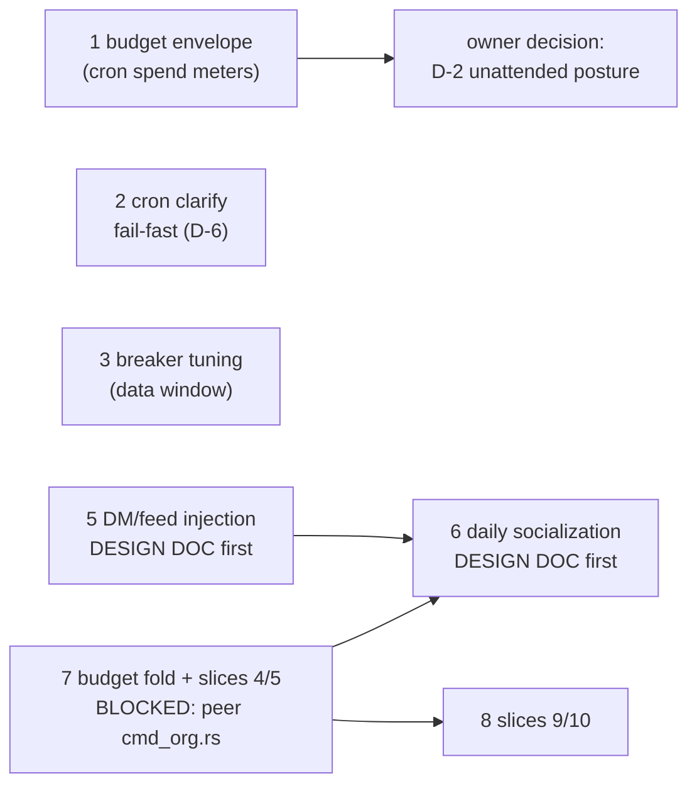

# Remaining implementation gaps — outline plan (2026-10-08)

> **Post-stretch revision (same day, after iters 677-680):** the wave map
> below now carries the full execution queue. Statuses: gaps 4, 2, 1 DONE;
> gap 5 phase 1 DONE (cron seam); gap 6 DESIGNED. What remains is ordered
> in the "Post-stretch execution plan" section — read that first; the
> wave sections below keep the detail and provenance for each item.

Status: OUTLINE. The execution stretch iters 661–673 closed every gap in the
2026-10-07 flaw audit; this is what remains after them, ordered by dependency
wave. Scope guard: the peer's `plan-2026-10-07-agentic-core-verified-remaining-work.md`
owns the ENGINE programme (guardrail ladder, steering, context ceilings,
dead-code); this plan owns the ORG/ORGANISM + governance programme. §6 of
their doc scopes the org layer to here explicitly. Zero overlap by design.

Provenance anchors (all verified at tip `5740997d`): budget envelope
construction `gateway_runner.rs:1040-1160`, turn-usage drain
`gateway_runner.rs:1157-1181` keyed `(platform, channel_id, thread_id)`,
wave-4 usage trap `gateway_runner.rs:3935`, seat seam
`scheduler.rs` `resolve_seat_id`/`run_agent_job`, BUGS.md D-2/D-6.

## Wave A — unblocked, substrate live

### 1. Cron-path budget envelope (recorded follow-up of iter-672) — DONE iter-678 `25ec77ce`
- **Problem**: seat budget provisioning (670/671) and policy binding (672)
  are live, but cron-run SPEND doesn't meter — a capped seat's cron jobs
  spend unmetered. Cron Usage events flow to the gateway receiver (shared
  `event_tx`) and drain under gateway DM keys `(platform, channel_id,
  thread_id)` (`gateway_runner.rs:1157-1181`) — cron-emitted events lack
  those, so `employee_window_usage` stays blind for cron. The wave-4 trap
  (`gateway_runner.rs:3935`: "before the wire, usage returned 0 forever")
  is the cautionary precedent.
- **Approach**:
  1. Instrument ONE live cron run — capture a Usage event, record the exact
     key fields cron events carry. No static reading substitutes for this.
  2. Scheduler-side drain: after `agent.run`, drain the run's usage into
     `employee_window_usage` under the resolved seat (`resolve_seat_id`,
     the one-resolution helper).
  3. Turn-start consult mirroring `gateway_runner.rs:1040-1160`:
     `resolve_budget` → `window_start` → `employee_window_usage` →
     hard-refuse or `SEAT_BUDGET_ENVELOPE.scope(...)`.
  4. Refusals recorded in `cron_runs` with an explicit origin
     (`budget_block`, alongside `scheduled`/`retry-armed`/`gate_block`).
- **Acceptance**: with a cap set, an over-cap cron run is refused with an
  auditable `cron_runs` row; cron spend visible in the budget surfaces.
- **Effort**: M. **Blockers**: none.

### 2. Cron `clarify` fail-fast (BUGS.md D-6 tail) — DONE iter-677 `adbf45cb`
- **Problem**: `USER_QUESTION_TX` (`user_question.rs:39`) is process-global,
  set once by `start_gateway` (`gateway_runner.rs:1066`). A cron agent
  calling `clarify`/AskUser routes into a HUMAN's chat — a scheduled job at
  03:00 can wake the owner (BUGS.md D-1b's worst case). Per D-6: "A cron
  agent that cannot ask a question should fail fast, not block on a channel
  nobody drains."
- **Approach**: unattended runs (`with_unattended(true)` already set on the
  cron agent since construction) fail fast on clarify instead of routing to
  the global channel — fail toward a `cron_runs` error row, not a hang.
  Alternative worth pricing in the design: route to the seat's DM channel
  (pairs with gap 5's read side), but fail-fast is the boring correct
  default.
- **Acceptance**: a cron run that calls clarify records a failure row;
  the interactive session never sees a scheduled job's question.
- **Effort**: S–M. **Blockers**: none.

### 3. Breaker threshold tuning (iter-664 follow-up) — DECIDED 2026-10-09: HOLD 6/6
- **Data note (2026-10-09, day 4 of the window)**: 0 degenerate/identical
  aborts across 87 cron runs since 10-05 (71 success, 16 failure —
  every failure is provider-capacity class: 9 stream deaths, 5 HTTP
  503, 1 HTTP 400, 1 interruption). The 6/6 thresholds never fired, so
  they cost nothing, and the real failure mode (provider capacity) is
  the retry-covered flake class (iter-669/673), not a degenerate loop —
  lowering to 2–3 would risk aborting legitimate retries under the
  exact provider flakiness the box sees daily. No threshold change, no
  test change; revisit only if a degenerate fire ever appears in
  `cron_runs`.
- **Problem** (original): degenerate-abort thresholds held at 6/6 (identical-streak /
  all-failure) — chosen observability-first; real distribution unknown now
  that `degenerate_detail` records actual tool names + last failure.
- **Approach**: collect 3–7 days of live `degenerate_detail` data; tune on
  evidence (2–3 vs 6); if changed, update the pinned contract tests in the
  same iteration.
- **Acceptance**: any threshold change carries a data note in the commit
  body; tests still pin the message contract. ✓ (no change → no test change)
- **Effort**: S. **Blockers**: none (decided early — the data was one-sided).

### 4. ~~DECISION: D-2 unattended posture~~ — DECIDED 2026-10-08 (owner ruling)
- **Ruling**: the unattended posture is managed by the **governance
  configuration itself** — the seat's policy row (`seat_policies`) with a
  `[genome].unattended_posture` global fallback — the same surface that
  manages tool permissions, and only that surface. No separate seam, no
  hardcoded behavior. The existing mode ladder expresses it (yolo stays
  yolo even unattended per standing directive; lockdown fails closed;
  scoped allows only scoped tools; standard fails closed on dangerous
  tools when unattended). Implementation = a consult at the existing
  guard reading the policy row / global default.
- **Effort**: S. **Blockers**: none — implementation can proceed.

## Wave B — owner feature directives (design-doc-first, per approved pattern)

### 5. Platform DM/feed context injection (owner directive) — phase 1 DONE iter-679 `8727449a`
- **Design doc delivered 2026-10-08**:
  `plan-2026-10-08-dm-feed-context-injection.md` — seven-stage pipeline
  (collect→normalize→dedup→rank→quota→render→inject), per-aspect
  character quotas (dm/global/dept/self, `seat_context_quotas` mirroring
  `seat_budgets`), re-ranking across the four classes (recency +
  lexical + authority + thread, in-process, no new deps), watermarks as
  the nonredundancy backbone, append-only `context_items` store.
  Phase 1 (org-internal sources) fully unblocked; phase 2 = platform read
  adapters; phase 3 = socialization rides it.
- **Effort**: phase 1 M, phase 2 L (per-platform).
- **Blockers**: none for phase 1 — implementation may proceed on the
  owner's go.

### 6. Daily socialization sessions (owner directive) — phases 1 DONE (iter-679/684); 2 DONE (iter-695); 3 DONE BY CONSTRUCTION
- **Phase 2 (iter-695 `784a92de`)**: the senior's session close-out posts
  to the board through the same §2.3.1 consult the CLI seams run —
  `resolve_actor_scope`/`live_grants_for` moved into
  `org/authority.rs` as the canonical consult companions (one resolver,
  CLI + scheduler callers), `post_session_outcome` writes the
  fail-closed-identity, consult-gated notice, and the scheduler treats
  a refusal as a skipped post (fail-open — both MEMORY.md files already
  carry the outcome).
- **Phase 3**: satisfied by construction — session outcomes reach the
  board (phase-2 notice) and the worklog (seat-attributed turn rows),
  both of which `org synthesize` (iter-692) digests into the org bank.
- Still dark: `[socialization] enabled=false` — the owner flips it to
  arm the 09:30 sessions.
- **Design doc delivered 2026-10-08**: `plan-2026-10-08-socialization-sessions.md` — adjacency pairing as data (7 pairs, senior initiates), power dynamics via grants (decisions flow down, information flows up, junior voice is an exceptional grant), the `dm_threads` 3-turn envelope, MEMORY.md densification on close, sessions meter under the seats' budget envelopes. Phase 1 = the socializer cast; phases 2/3 wait on wave C.
- **Effort**: phase 1 M. **Blockers**: owner approval of the design.

## Wave C — blocked on the peer's `cmd_org.rs` WIP (still dirty in-tree)

### 7. Budget fold + Slices 4/5 (authority predicates + read surfaces) — DONE iter-688 `a5766fb1`
- **Landed in a detached worktree at origin/main** (owner ruling, 2026-10-08):
  the peer's tree carried uncommitted rustfmt residue on `cmd_org.rs`/
  `cmd_budget.rs` plus 3 unpushed iter-685 commits at execution time, making
  the shared tree unpublishable; the worktree never touched their state.
- `can_post_to` enforced at the notice-post seam (per-recipient consult,
  fail-closed identity: unregistered senders refused; `user`/`system` =
  operator root, not gated); `can_accept_decision` enforced at the accept
  seam via a new `--as` actor arg; `org budget` fold (top-level namespace
  gone); `org cast` + `org audit <seat>` read surfaces live.
- Also annotated six accumulated clippy deny sites in operant-core
  (gate restored on the crate; two remain in the peer's fresh TUI).
- **Problem**: `operant budget` lives as a top-level namespace only because
  `cmd_org.rs` is peer-dirty (iter-670's recorded intent: fold into
  `org budget`). Slices 4/5 of the org plan are unwired: authority
  predicates `can_post_to`/`can_accept_decision` at the notice-post/accept
  seams, and read-only surfaces (`org cast`, `org audit`, spend views).
- **Approach**: when the peer's file lands: fold cmd_budget into cmd_org
  (`org budget set/list/clear`), wire predicates at the seams, add the
  read-only CLI surfaces. All test-green substrate exists (seat-budget
  suite 8/8, registry 28/28).
- **Acceptance**: predicates enforced with tests; budget commands reachable
  under `org`; no orphan namespace.
- **Effort**: M. **Blockers**: peer `cmd_org.rs` lands. Coordinate via
  `agent://<peer>` before touching anything adjacent.

### 8. Slices 9/10 (chief-of-staff synthesis + identitarian evolution) — DONE iter-692 `3b2eadfd`
- **Landed**: `operant org synthesize [--window-hours N] [--dry-run]`
  (new `org/synthesis.rs`) composes the org digest over a window,
  retains it to the **org memory bank** (bank `org` in the same
  memory_wire.sqlite), and posts it as a chief-of-staff broadcast
  notice (broadcast is the §3.2 global tier — `can_post_to` allows it
  at any scope, no grant needed). Mechanical/deterministic by design:
  the org layer keeps its no-tool-surface rule, every write an
  auditable CLI seam.
- `org_decisions` gained `amend_seat`/`amend_charter` (with a
  PRAGMA-probe ALTER migration for pre-692 files); `org decision
  propose --amend-seat <SEAT> --amend-charter <TEXT>` stores the pair
  (both-or-neither); `org decision accept` applies the amendment BEFORE
  the status transition — a failed amendment leaves the decision
  proposed. `EmployeeDb::amend_charter` is the only sanctioned charter
  write besides the cast seeder. `org audit <seat>` shows the charter
  posture (present + fingerprint + last-touched).
- **Verified live**: synthesis retained+posted against the real org
  state; a full propose→accept cycle re-ratified dispatcher's charter.
- **Problem** (original): no synthesis loop (notices → org memory bank + seat notices)
  and no decision→amendment path (seats can't evolve charters through
  ratified decisions).
- **Approach**: implement after 7 — synthesis rides the predicates and
  read surfaces; amendments ride the decision-accept seam.
- **Acceptance**: chief-of-staff daily digest writes org bank + routes
  notices; a ratified decision amends the seat's charter and shows in the
  registry. ✓ both met.
- **Effort**: M–L. **Blockers**: 7 (cleared by iter-688).

## Debts & housekeeping (not features)
- **Test debt (verify, maybe stale)**: BUGS.md D-2 note (:73-75) claims no
  test pins the `scheduler.rs:277` session-id derivation; `cron_session_isolation`
  (6/6 green at tip) may already cover it — verify and either close the note
  or add the pin.
- `~/.operant/backups/packet-e-wt-wip-20261007.tar.gz` (56KB, peer's stale
  superseded WIP): deletion awaits owner sign-off; not touched.
- Iteration-label collisions 661/669/671 (peer windows): cosmetic,
  append-only, already noted in bodies; the mechanical-label fix has held
  since (672/673 clean).
- Provider capacity (503s/stream deaths) remains the growth constraint;
  iter-669/673 retries cover the flake class, not the capacity.

## Post-stretch execution plan (2026-10-08, after iters 677-680)

The ordered queue for the next execution stretch. Each item: approach,
acceptance, effort, blockers.

### Step 0 — Live-verify the 13:00 UTC tick (operational, no iteration)
The first live run of the full new path (seat binding + seat memory +
feed injection + metering + envelope) lands at the next top-of-hour.
Confirm before building more on top: `context_watermarks` populates
for the hourly seats; `employee_window_usage` is non-zero for
`dispatcher`/`identity-warden` (cron spend now meters — the wave-4
trap actually closed); no repeated-content injections across ticks.

### Item 1 — Gap 5 phase 1b: the gateway turn-start seam (S–M, unblocked)
- **Problem**: injection is live on the CRON path only; a gateway DM turn
  still misses cross-session feeds/DMs it has not consumed.
- **Approach**: mirror the cron seam — the injector handle goes on the
  `GatewayRunner` struct (the `summary_ttl_minutes` precedent; avoids a
  second process-global), the render call sits at turn start next to
  the budget consult (gateway_runner.rs:1040-1160 area), seat from the
  session entry's `employee_id` binding. **Transcript check**: never
  re-inject the inbound message itself — hash the recent user turns of
  the hot session and drop matching items at render (the design doc
  §3.3's third dedup layer).
- **Acceptance**: a DM turn sees unseen feeds; its own inbound message
  is never echoed back; `enabled=false` byte-identical.
- **Blockers**: none. gateway_runner.rs is clean (not peer-dirty).

### Item 2 — Gap 6 phase 1: the socializer cast (M, unblocked)
- **Approved design**: `plan-2026-10-08-socialization-sessions.md` —
  build exactly that, nothing wider.
- **Approach**: (a) `[org.socialization]` config section (enabled=false
  default, 09:30 schedule, pairs as data); (b) a `socializer` module
  that opens `dm_threads` per pair, drives senior-first turns as full
  agent runs (seat binding + seat memory + injected context — every
  landed seam composes), enforces the shared 3-turn budget, closes;
  (c) bounded outcome appends to BOTH seats' MEMORY.md under a
  `## Socialization <date>` heading; (d) `cron_cast_socializer`
  registration in the cast seeder so the registry stays 9-seats+
  socializer — **owner note**: this adds a 10th registry row by
  design; flag if you want the socializer infra-owned instead.
- **Acceptance**: 09:30 pairs hold 3-turn sessions; both seats'
  MEMORY.md gain the session outcome; spend lands in both rollups;
  `enabled=false` = zero behavior change.
- **Blockers**: none hard. Notice-posting outcomes stay deferred to wave C.

### Item 3 — Gap 3: breaker threshold tuning (S, time-gated ~2026-10-11)
Collect `degenerate_detail` rows until the window closes, then decide
6/6 vs 2-3 on data; any change updates the pinned contract tests in the
same iteration.

### Item 4 — Small debts (S, opportunistic)
- **BUGS.md D-2 test debt (:73-75)**: verify whether
  `cron_session_isolation` already pins the `scheduler.rs` session-id
  derivation; close the note or add the pin.
- **4 lib-test warnings** from the 679 build: identify, clean or annotate.
- `~/.operant/backups/packet-e-wt-wip-20261007.tar.gz`: deletion awaits
  owner sign-off.

### Item 5 — Gap 7: budget fold + slices 4/5 (M, BLOCKED — peer dirty)
`cmd_org.rs` AND `cmd_budget.rs` still carry the peer's WIP (checked
2026-10-08; their TUI refactor — jcode_*→operant_* renames — is in
flight in the same tree). Fold `operant budget` → `org budget`, wire
`can_post_to`/`can_accept_decision` at the notice seams, add the
`org cast`/`org audit` read surfaces. The moment their files land.

### Item 6 — Gap 8: slices 9/10 (M–L, blocked on 5) — DONE iter-692
Chief-of-staff synthesis (notices → org bank + seat notices) and the
decision→charter amendment path. Depends on 5's predicates and read
surfaces. Socialization phases 2/3 ride the same unblock.

### Item 7 — Gap 5 phase 2: platform read adapters (L per-platform, last) — BLOCKED on credentials
Telegram `getUpdates`/`getChat`, Discord channel history, Slack
`conversations.history` → the `Dm` class through the same collectors;
the durable `context_items` store lands here (design doc §5 deferred
from phase 1 — pull-once reads need a landing). Order after 1b so the
DM class renders on both seams at once.
- **Blocker (verified 2026-10-09)**: there is nothing to read from.
  `TELEGRAM_BOT_TOKEN` is empty/unset (the standing delivery-hop blocker
  — `getMe` 404s; a `getUpdates` read adapter would fail the same
  way), `discord_enabled = false`, `slack_enabled = false`, and
  DISCORD/SLACK tokens are unset. Building L-effort adapters now would
  be unverifiable dead code behind broken credentials. Inbound DMs
  already land in `context_items` through the iter-679 gateway tap, so
  the moment the Telegram credential closes, the read adapter is the
  only remaining piece. **Owner action needed**: a working bot token
  (or a decision to defer platform monitoring permanently).

### Execution order
0 → 1 → 2 → 3/4 (when the window/prompt suits) → 5 → 6 → 7.

