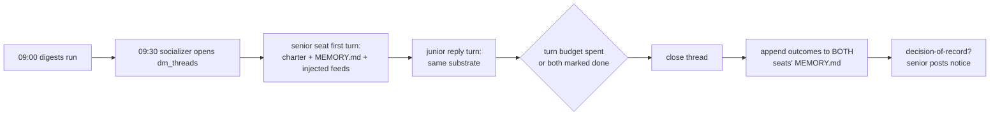

# Daily socialization sessions — design (2026-10-08)

Status: DESIGN (docs-first per the approved pattern; no code yet).
This is gap 6 of
`plan-2026-10-08-remaining-implementation-gaps.md`, riding the substrate
gap 5 phase 1 just landed (`org/context_injection.rs`) plus the existing
`org dm` threads (§10.3) and seat MEMORY.md files.

## §1 Problem

Seats run isolated cycles. The owner's directive: hierarchy-aware daily
seat-to-seat sessions **with power dynamics** — seats should socialize,
exchange context, and densify their identities through structured,
authority-aware conversations, not just pass each other worklog rows.

## §2 Substrate already live (do not rebuild — the do-not-rebuild ledger)

| Piece | Where | What it gives this design |
|---|---|---|
| `org dm open/spend/close` | `org/dm_thread.rs` (`dm_threads`: participants JSON, turn_budget, turns_used, state) | The session envelope: 2-party threads with SHARED turn budgets |
| Seat MEMORY.md | `<root>/org/employees/<seat>/MEMORY.md`, injected at cycle start (iter-666) | Each seat enters with its own densified ledger; session outcomes append |
| Context injection | `org/context_injection.rs` (iter-679) | The DM aspect class + ranked feed context rides every session turn |
| Grants / authority | `org/authority.rs` + `SeatApprover` | The power-dynamics mechanism: who initiates, whose decisions bind |
| Seat budgets | `seat_budgets` + the cron envelope (iter-678) | Sessions meter spend under the SAME per-seat rollup |
| Charter registry | `employees.system_prompt` | Each seat's identity — the thing socialization densifies |

## §3 Session topology — adjacency, not a round-robin

A round-robin of 9 seats is 36 pairs/day — noise, not socialization.
Daily sessions are **adjacency-paired** by the org's actual reporting
structure, and the PAIRING IS DATA (a `socialization_pairs` config),
seeded once, adjustable by the owner:

```toml
[org.socialization]
enabled = false        # dark-mergeable, like every wave
schedule = "0 30 9 * * *"   # 09:30, after the 09:00 digests
pairs = [
    ["premiere", "chief-of-staff"],
    ["chief-of-staff", "crew-chief"],
    ["chief-of-staff", "hrmaster"],
    ["chief-of-staff", "governor"],
    ["crew-chief", "dispatcher"],
    ["crew-chief", "identity-warden"],
    ["hrmaster", "compass"],
]
```

Nine seats, seven pairs — each seat socializes exactly once a day.

## §4 Power dynamics — grants ARE the hierarchy

The owner wants real power dynamics, and the org already has the
mechanism: **authority is grants, not vibes** (§2's ledger).

- **Who initiates**: the pair's SENIOR seat (premiere > chief-of-staff >
  department heads > crew > dp — the same static ladder as the
  injection's `authority_of`, upgradeable to the Wave 3 authority
  model) opens the thread. The junior answers. An interaction where
  the junior opens must be an explicit grant ("voice") — visibly
  exceptional, because it IS exceptional.
- **Whose statements bind**: a senior's directive in a session carries
  its authority: when the pair reaches a decision of record, only the
  senior seat can post it as a notice (slices 4/5's `can_post_to`
  predicate when the peer's `cmd_org.rs` lands), and the junior's
  ratification is what makes it org-visible. This is the daily
  exercise of hierarchy the owner asked for — decisions flow down,
  information flows up.
- **Budget asymmetry**: the shared `dm_threads.turn_budget` stays
  shared (3 turns default) — power is in who speaks first and whose
  decision binds, not in who gets more tokens.

## §5 The daily flow (one pair, one session)



- Each turn is an agent run over the thread's topic: the injected
  context (gap 5) gives both seats the org's feeds; the MEMORY.md gives
  each its own continuity.
- The **socializer** is a small coordinator (a new cron cast,
  `cron_cast_socializer`) that opens pairs, drives each turn, and
  closes threads — seats never spawn processes themselves.
- Turn budgets: 3 shared turns per pair per day (the existing
  `dm_threads` default) — a conversation, not a chatroom.

## §6 Memory densification — the point of the exercise

After close, the socializer appends a bounded summary line to BOTH
seats' MEMORY.md files under a `## Socialization <date>` heading:
what each learned of the other, decisions taken, next intents. This
is the two-tier memory doc's seat tier doing its job — curated,
visible, operator-editable. The org tier stays governance-writers-only
(slices 9/10's synthesis, a later wave).

## §7 Governance

- Sessions meter spend under the seats' budget envelopes (both turns
  drain into the rollup like any cron run — iter-678's meter).
- Scoped seats receive only in-scope content in their turn context
  (gap 5's scope filter applies).
- The unattended posture (D-2, `[genome].unattended_posture`) governs
  dangerous-tool asks inside sessions exactly like any cron run.

## §8 Phasing

| Phase | Scope | Effort | Blockers |
|---|---|---|---|
| **1** | The socializer cast: pairs config, thread open/drive/close, senior-first turns, MEMORY.md outcome appends | M | owner approval of this design |
| **2** | Decisions-of-record: notice posting gated on slices 4/5 predicates | S | peer's `cmd_org.rs` (wave C) |
| **3** | Chief-of-staff synthesis of session outcomes → org bank | M | slices 9/10 |

## §9 Acceptance

- Daily at 09:30, the configured pairs hold 3-turn sessions; each seat's
  next cycle's MEMORY.md reflects what it learned.
- The senior seat's decision posts as a notice (phase 2) with the
  junior's ratification; nothing else can.
- A session's spend appears in both seats' budget rollups.
- `enabled = false` (default) = zero behavior change, byte-identical.

## §10 Open questions — resolved by default

1. Pairing as config vs derived from a future org chart → **config**
   now; an org-chart derivation can generate the same table later.
2. Do juniors get an opening turn? → No — voice is a grant, visibly
   exceptional (§4). The owner can mint it pair-by-pair.
3. Session transcript storage → the thread's turns land in the
   worklog (employee-attributed rows, like every cron run); no second
   store.
