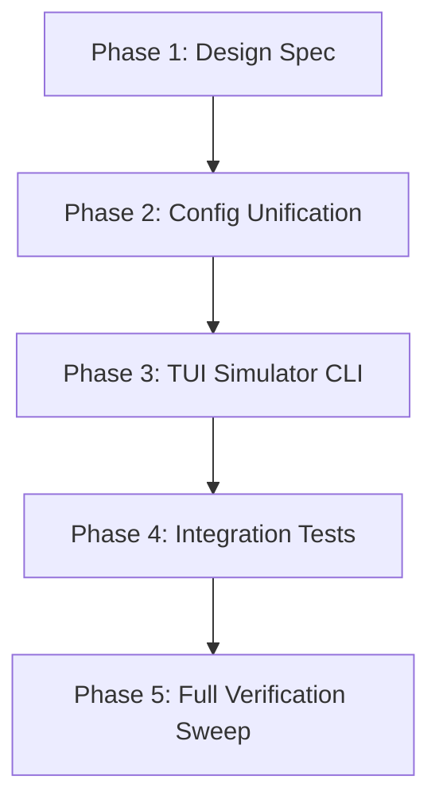

# TUI Configuration Unification and Debugging Simulator Spec

**Date**: 2026-07-10  
**Status**: Approved / Draft  
**Target Iteration**: `iter-214`  

---

## 1. Executive Summary

This spec outlines the implementation plan to unify TUI configuration, resolve local configuration conflicts, and introduce automated headless simulation to enable continuous TUI-level regression checking.

By completely eliminating the duplicate `adapter_types::config::Config` wrapper, the TUI will consume `operant_core::config::AppConfig` directly, resolving the configuration drift that caused settings to be ignored or overridden. In addition, we will introduce a headless simulator command (`operant tui debug simulate`) and test harness using `ratatui::backend::TestBackend` to simulate interactive keystroke runs in autonomous development loops.

---

## 2. Refactor Phases & Trackers

### Progress Tracker

| Phase | Description | Status | Target Iteration |
|---|---|---|---|
| **Phase 1** | Design Spec & Baseline Alignment | ⏳ Active | `iter-214` |
| **Phase 2** | Configuration Unification & settings.json Isolation | 📋 Pending | `iter-215` |
| **Phase 3** | Headless TUI Simulator Subcommand | 📋 Pending | `iter-216` |
| **Phase 4** | Integration Test Suite Expansion | 📋 Pending | `iter-217` |

---

## 3. Configuration Unification (Phase 2)

Currently, `adapter_types::config::Config` duplicates fields like `provider`, `model`, `theme`, `permission_mode`, etc. We will:
1. Delete `adapter_types::config::Config` from `crates/operant-cli/src/tui/adapter_types.rs`.
2. Refactor TUI components to read fields directly from `inner: operant_core::config::AppConfig` (aliased or used directly on the `App` struct as `app.config: AppConfig`).
3. Isolate `Settings` to only contain TUI-only display and editor choices:
   ```rust
   pub struct Settings {
       pub theme: Option<String>,
       pub vim_mode: bool,
       pub effort_level: Option<String>,
       pub output_style: Option<String>,
   }
   ```
4. Modify `App::persist_config` and startup overlays to synchronize state changes directly to the main `operant.toml` (for provider/model) and `settings.json` (strictly for TUI preferences).

---

## 4. Headless TUI Simulator (Phase 3)

We will introduce a new subcommand `simulate` to the existing TUI debugging subcommand suite:
`operant tui debug simulate --keys <sequence> [--output <json-log-path>]`

### How it works:
1. It creates an `App` using `TestBackend::new(120, 40)`.
2. It parses the `--keys` string into individual keystroke events (e.g. converting `\n` to `Enter`, `/mcp` to a sequence of characters, etc.).
3. It pushes these events into the TUI's input queue.
4. It ticks the `App::run` frame loop (calling `render_app` onto the `TestBackend`).
5. On completion or exit (e.g. after processing all keys or receiving a quit event), it inspects the `TuiDebugHub` event log.
6. If any `TuiEvent::Error` or panics are caught, it exits with code `1`, printing the traceback; otherwise, it exits with `0`.

---

## 5. Integration Test Harness (Phase 4)

We will add a new set of tests inside `crates/operant-cli/src/tui/app.rs` under `mod tests` that:
- Setup a dummy `AppConfig` and dummy `Database`.
- Initialize `App` with `TestBackend`.
- Dispatch sequence of simulated inputs.
- Assert final render frame contents or state matching (e.g. verifying command routing, overlay visible states, or message list size).

---

## 6. Implementation Plan & Timeline


