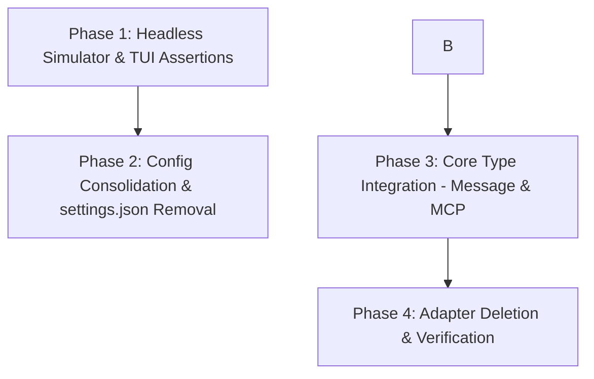

# Design Spec: TUI Debugging Infrastructure and Refactor Plan

This document defines the plan to upgrade the TUI debugging infrastructure, unify configuration sources, eliminate type duplication between the TUI and `operant_core`, and implement robust headless test suites.

## Architectural Context & Goals

Currently, the TUI has structural debt:
1. **Type Duplication**: `adapter_types.rs` defines its own `Message`, `Role`, and `McpManager` stubs. This leads to drift and bugs (e.g. thinking text displayed incorrectly).
2. **Config Proliferation**: Configuration exists across 6 distinct files/formats (TOML, YAML, JSON, env). Stale settings in `settings.json` override manual updates to `operant.toml`.
3. **Debugging Loop**: Headless simulation exists, but needs to be robust and testable to allow safe refactoring.

We aim to:
- Establish a complete, multi-step headless TUI testing framework.
- Unify configuration to `operant.toml` + `.env`.
- Remove the duplicated types and wire TUI widgets directly to `operant_core` types.
- Ensure the build, clippy, and tests remain green at every single commit iteration.

---

## Proposed Refactoring Phases

### Phase 1: Headless Simulator & TUI Assertions
- **Action**: Add assertion capability to the `simulate` CLI subcommand.
- **Goal**: Allow running TUI test scripts to verify correct states (e.g., that overlays open and close under key sequences).
- **Implementation**:
  - Expose a `--assert` flag on `operant tui debug simulate`.
  - Record panel state snapshots inside the simulation loop.

### Phase 2: Config Consolidation & Settings Removal
- **Goal**: Consolidate settings so that `operant.toml` is the single source of truth for all runtime configuration.
- **Implementation**:
  - Remove provider and model configuration from `settings.json`.
  - Use `AppConfig` directly in `TuiApp` instead of wrapping it in `adapter_types::config::Config`.
  - Persist only TUI-specific visual preference fields (like theme or vim_mode) in the JSON settings file.

### Phase 3: Core Type Integration
- **Goal**: Remove duplicate data structures.
- **Implementation**:
  - Delete `adapter_types::types::Message` and use `operant_core::client::Message` directly.
  - Delete `adapter_types::types::Role` and use `operant_core::client::Role` directly.
  - Wire `/mcp` directly to `core_mcp_manager` instead of the stub.
  - Update `ContentBlock` helper to render directly from `core::client::Message`.

### Phase 4: Adapter Deletion & Final verification
- **Goal**: Clean up residual stubs in `adapter_types.rs` and verify all tests pass.
- **Implementation**:
  - Delete unused stub methods.
  - Perform workspace-wide lint and test runs.

---

## Verification & Iteration Strategy

Every phase is one or more distinct iterations. We will:
1. Sourcing `scripts/dev-env.sh`.
2. Compiling with `./scripts/check.sh check -p operant-core --lib` and `./scripts/check.sh check -p operant-cli --bin operant`.
3. Running tests via `./scripts/check.sh test --workspace`.
4. Staging files surgically and committing with `feat(iter-N): ...` or `fix(iter-N): ...`.
5. Pushing immediately.
